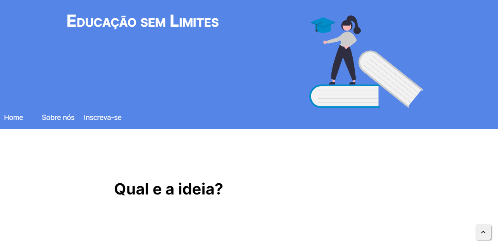
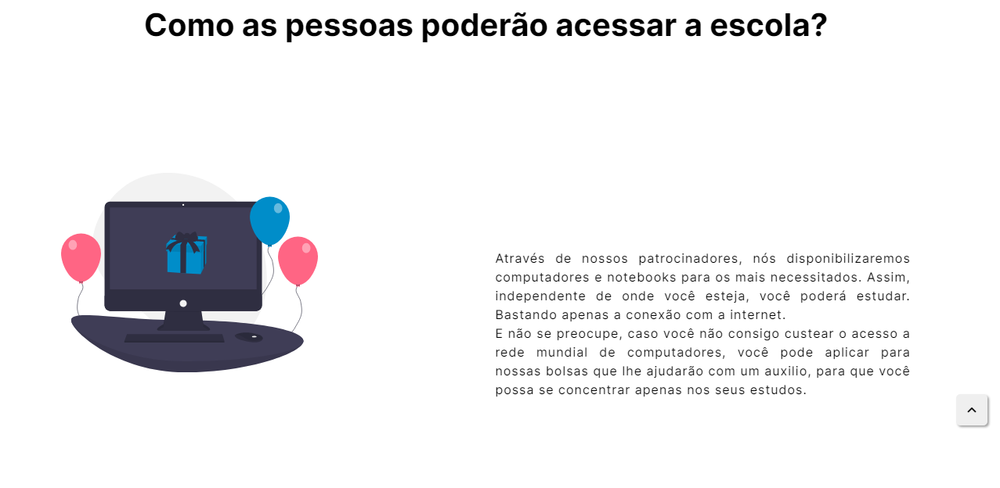
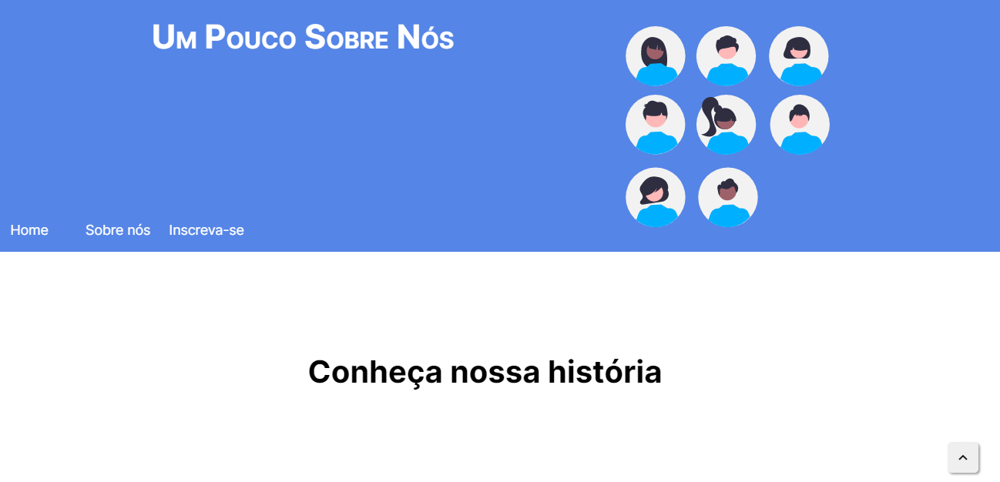
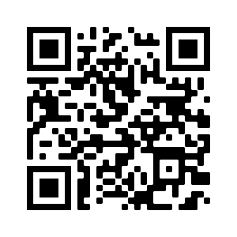

    <h1>🖐 Olá, tudo bem?   <em>🖐 Hello, how are you?</em></h1>
    <h4>Este e um projeto desenvolvido para o desafio do DoWhile da Rockseat. E uma landing page de uma escola fictícia a onde o objetivo e levar a educação para todos os cantos, e a todas as pessoas carentes. Espero que gostem, fique a vontade para dar uma olhada. 😄    <em>This is a project made for Rockseat's DoWhile challenge. It's a landing page of a fictitious school, where the objective is take the education everywhere and all of the peoples too. I hope you like it and feel free to take a look. 😄 </em></h4>

 

<h3> 📸 Algumas fotos do projeto:   <em> 📸 Some pictures of the project:</em></h3>

 

 

<h3>Link do projeto e QR Code para você poder visualizar:   <em>Link of the project and QR Code for you to view:</em></h3>

 

<a href="https://hugocamposarimathea.github.io/desafio/">👉🏽 Clique aqui para ir ao site 👈🏽   <em>👉🏽 Click here to go 👈🏽</em></a>

 

 

  

<h3>📧 Quer entrar em contato comigo?   📧 If you want to talk to me, send me an e-mail:</h3>

        
         

